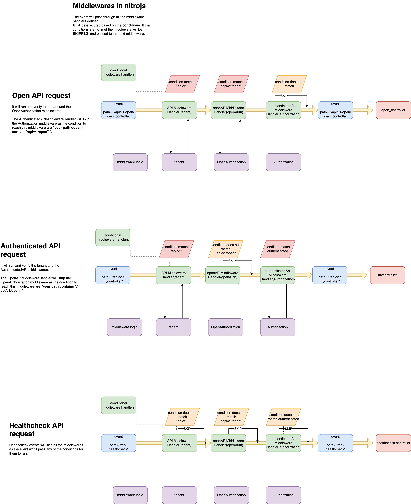

# nitro-conditional-middleware

## Development

### install

```bash
npm install
```

### test

```bash
npm run test
```

### lint

```bash
npm run lint:fix
```

### build

```bash
npm run build
```

## Documentation

A brief explanation on how middlewares in nitrojs work.

NitroJS provides as base for their middlewares H3 event handlers created by `defineEventHandler`.

Middlewares in the nitrojs framework are executed in every request.

## Real life scenarios

In this diagram we display 3 different scenarios that our server needs to handle:

- Open API requests
- Authenticated API requests
- HealthCheck Requests

### Problem

Knowing that all events will pass through all middlewares, we need to plan the **flow** based on **conditions** that will **run** or **skip** these middlewares



## Skipping middlewares

With the constrain that the event flow will pass through all middleware event handlers, we needed a way to skip a middleware for some events that will go through the middleware pipeline based on a particular condition.

This library creates a way to pass a condition as parameter to create `defineMiddlewareHandler` functions with a run condition. This function has the same signature as as H3's `defineEventHandler`. Making it a 1:1 substitute.

```ts
type condition = (event: H3Event) => boolean

// This function would return a handler as H3's `defineEventHandler`
const defineMiddlewareHandler = createMiddlewareHandler(condition)
```

### Creating and using multiple `middlewareHandler`s handlers

```ts
// defineApiMiddleware.ts
import { createMiddlewareHandler } from 'nitro-conditional-middleware'

const apiV1MiddlewareHandler = createMiddlewareHandler((event) => {
  return event.path.includes('/api/v1/')
})

const apiV2ConditionFn = (event: H3Event) => boolean {
  return event.path.includes('/api/v2/')
}

const apiV2MiddlewareHandler = createMiddlewareHandler(apiV2ConditionFn)
```

```ts
// usage 1.my-first-middleware.ts
import { apiV1MiddlewareHandler } from './defineApiMiddleware'

const myFirstMiddleware = (event) => {
  console.log('myFirstMiddleware: This will only run in api/v1 endpoints')
}

export default apiV1MiddlewareHandler(myFirstMiddleware)
```

```ts
// usage 2.my-second-middleware.ts
import { NitroUtil } from '@frontend/utils'

import { apiV2MiddlewareHandler } from './defineApiMiddleware'

const mySecondMiddleware = (event) => {
  console.log('mySecondMiddleware: This will only run in api/v2 endpoints')
}

export default apiV2MiddlewareHandler(mySecondMiddleware)
```
